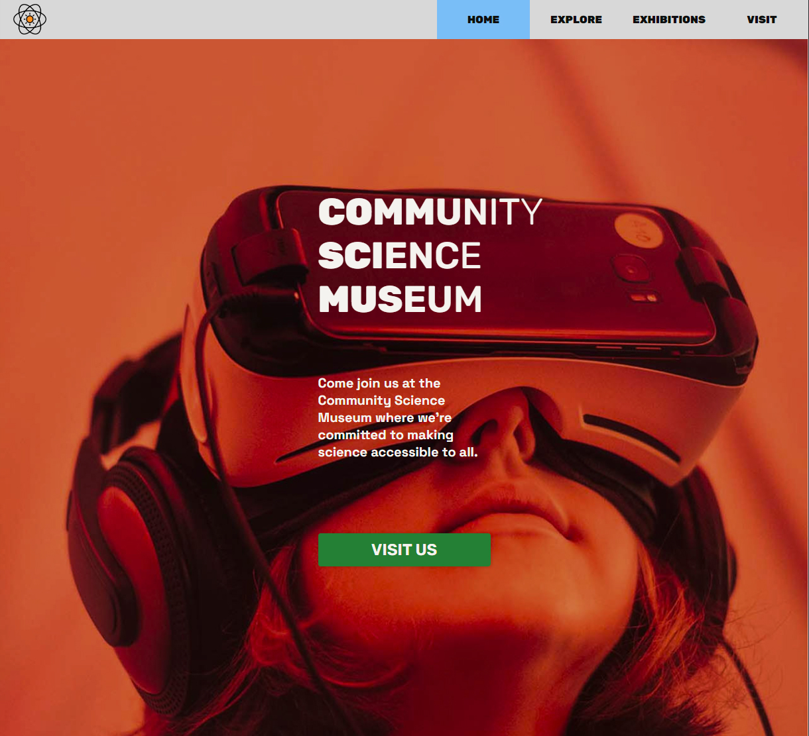

# Community Science Museum



Museum Website

## Description

This is a museum website created for our first semester project. 
It is a simple website using only HTML and CSS, and the main focus is to encourage people and especially youngsters to come visit the museum.
The website has several pages: 
- Home
- Explore
- Exhibitions
- Visit 

## Built With

- HTML
- CSS

## Getting Started

### Installing

1. Clone the repo:

```bash
git clone https://github.com/ddyrnes/semester-project1
```

## Contact

dev.dyrnes@gmail.com

[My LinkedIn page](https://www.linkedin.com/in/daniel-dyrnes-3a478a253/)
